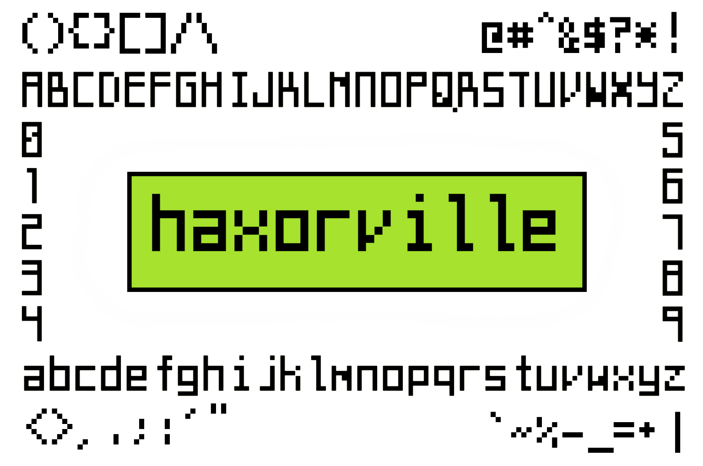
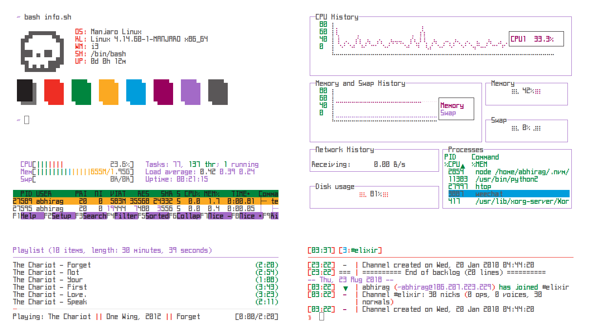

# haxorville

A quirky monospaced font designed for programmers and terminal dwellers.

| `Type`        | `Glyphs`      | `Weight`      | `Italics`     | `Ligatures`   |
| ------------- | ------------- | ------------- | ------------- | ------------- |
| Vector Font   | Basic Latin   |  Regular      | No            | Hell No       |

## Screenshots 

